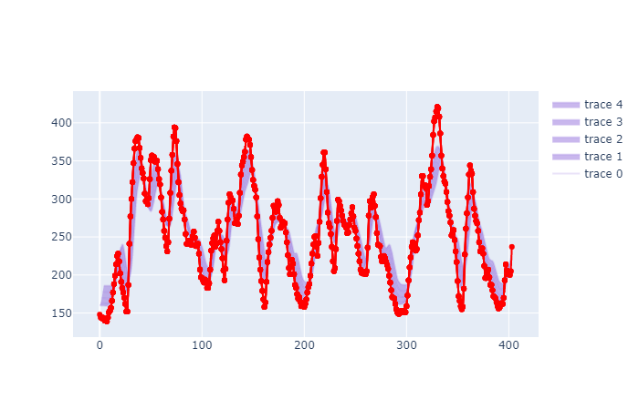

# Glucose Forecasting model

This is a prototype of a personalized glucose forecasting model using an LSTM - GRU configuration that predicts the probabilistic distribution of future glucose levels based on a dataset comprising historic CGM, food intake data.

- Datasets used: D1NAMO [(paper)](https://www.sciencedirect.com/science/article/pii/S2352914818301059), 14 day patient CGM dataset
- Data description and fields used: Historic glucose, carbohydrates, protein, fat, calories, steps

- State of the art techniques used: GluNet [(paper)](https://pubmed.ncbi.nlm.nih.gov/31369390/#:~:text=In%20this%20work%2C%20we%20introduce,meal%20information%2C%20insulin%20doses%2C%20and), Time series for medical data with missing values [(paper)](https://pubmed.ncbi.nlm.nih.gov/31369390/#:~:text=In%20this%20work%2C%20we%20introduce,meal%20information%2C%20insulin%20doses%2C%20and)

## Results

  
 
 The model performs fairly well with an average error of +/- 15 mg/dL  on 2 hr forecasting.